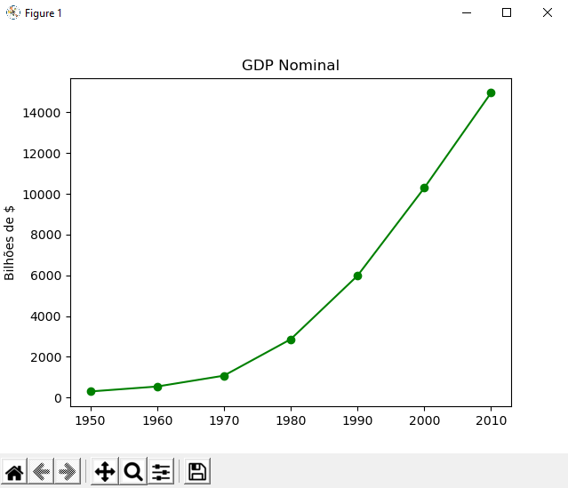
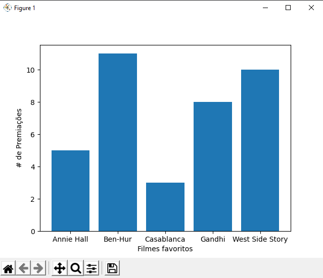
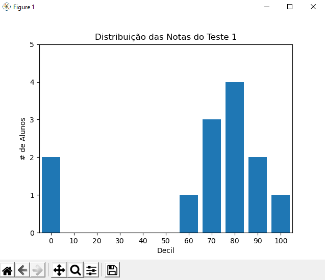
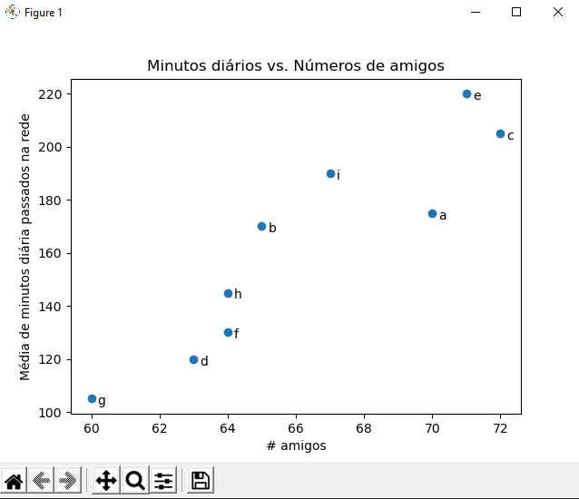
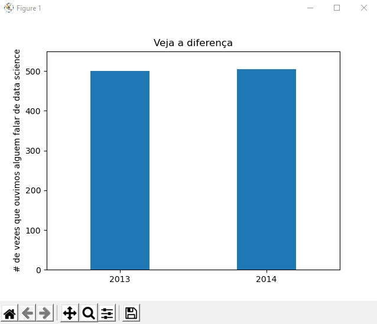

# Data Science visualizacao de dados

## Sobre
  Nesse projeto fiz funções que tem como objetivo extrair dados e apresentar os dados em gráficos.

## Gráficos

  
<b>Grafico de linha</b>

  
  
  
<b>Grafico de Barra</b>

  
  
  
<b>Grafico de histograma</b>

  
  
  
<b>Grafico de dispersão</b>

  
  
  
<b>Grafico de barra</b>

  
  

